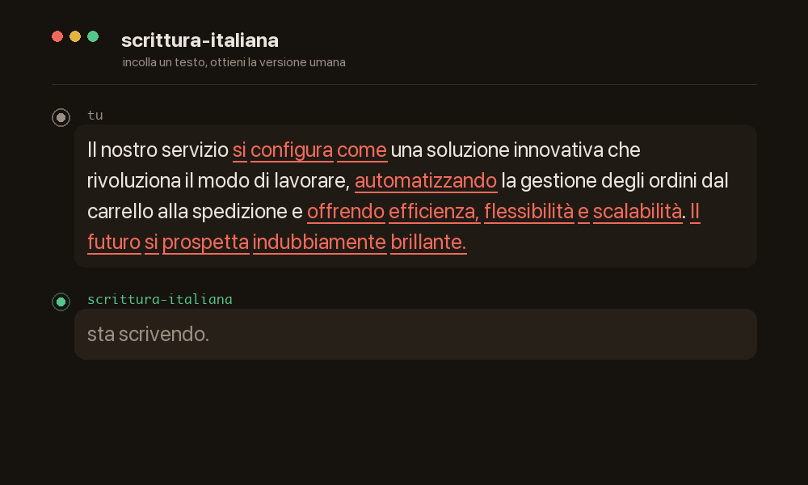
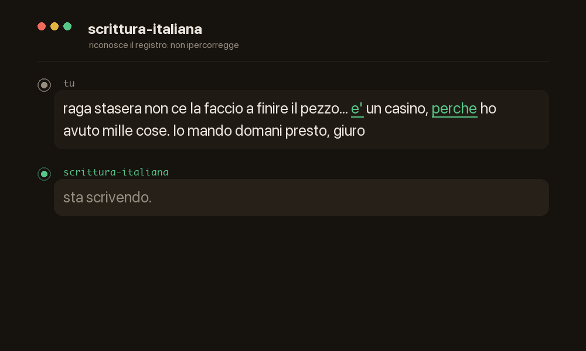
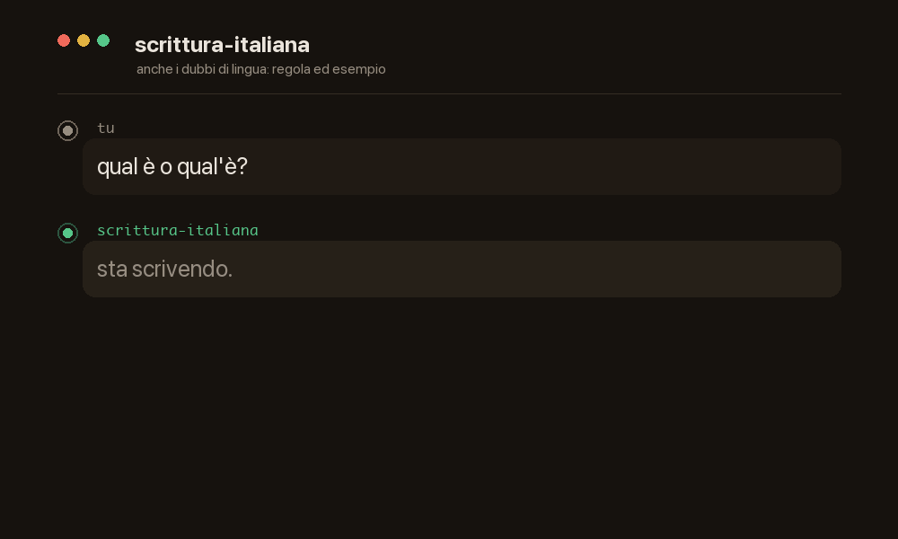

# scrittura-italiana — l'humanizer italiano che sa davvero l'italiano

> Trasforma la prosa generata in italiano naturale — e a differenza dei *paraphraser* non con
> scambi di caratteri o sinonimi, ma con **vera competenza di lingua**. Toglie i tic dell'AI
> (perifrasi, gerundite, triadi, trattini lunghi, frasi fatte), corregge stile, sintassi,
> punteggiatura e retorica, e **conserva fatti, tesi, registro e voce**. Non un filtro a
> posteriori: **impone al modello un processo editoriale fondato sull'italiano**, invece di
> lasciarlo seguire le proprie abitudini generative.
>
> *A Claude [Agent Skill](https://docs.claude.com/en/docs/claude-code/skills) — an Italian
> humanizer that turns AI prose into natural Italian through real linguistic competence, not
> paraphraser tricks. Fixes style, syntax, punctuation and rhetoric while preserving facts,
> thesis, register and voice. Content is in Italian.*

<p align="center">
  
</p>

[](https://hypnosdesign.github.io/claude-skill-scrittura-italiana/)
[](https://creativecommons.org/licenses/by-sa/4.0/)


🔗 **[Sito del progetto →](https://hypnosdesign.github.io/claude-skill-scrittura-italiana/)**

## Cos'è

Il punto di partenza di quasi tutti: **incolli un testo che "sa di AI" e te lo restituisce
umano** — via perifrasi, gerundite, triadi, avverbi in *-mente*, trattini lunghi, antilingua,
cliché, chiusure ottimistiche vuote. Fin qui, un humanizer.

**Il metodo è la differenza**: a differenza di un trova-e-sostituisci, questa skill conosce
l'italiano per davvero, perché è costruita sulle **quattro virtù dell'espressione**
(*virtutes elocutionis*) della retorica classica:

1. **aptum** — appropriatezza a scopo, destinatario, registro e **livello di controllo** del
   testo (editoriale vs web/social): nel testo informale le convenzioni da tastiera — virgolette
   dritte, accenti "da tastiera" — non sono errori e non vanno corrette.
2. **puritas** — correttezza **tipografica** (virgola, punto e virgola, due punti, virgolette
   caporali « » vs dritte, trattino vs lineetta, maiuscole, sigle) e **di parola** (accenti,
   omofoni come *da/dà*, *qual è*, *un po'*, *sé stesso*, plurali difficili, *tu/te*).
3. **perspicuitas** — chiarezza: il lettore capisce alla prima.
4. **ornatus** — bellezza *regolata*: figure, ritmo, argomentazione, costruzione del testo
   (incipit, sviluppo, chiusura). Il suo eccesso (la *mala affectatio*) è esattamente lo
   **slop dell'AI** — perifrasi, gerundite, triadi, avverbi in *-mente*, aggettivi pomposi,
   antilingua e affettazione all'italiana — che la skill riconosce e rimuove (73 pattern
   stilistici + 2 invarianti semantiche, 75 controlli numerati, oltre al repertorio di cliché).

Il principio guida è l'**equilibrio**: ogni virtù sta tra due vizi, per difetto (sciatteria,
oscurità) e per eccesso (slop). La differenza rispetto a un semplice "umanizzatore": qui c'è
sia il livello prescrittivo (punteggiatura) sia quello costruttivo (retorica applicata), con
un **workflow ordinato** che va dalla struttura alla pelle.

Oltre all'umanizzazione, la skill copre l'intero arco della scrittura: **sintassi** (congiuntivo,
*consecutio*, periodo ipotetico), **coesione** (il filo tra frasi e capoversi, i connettivi),
**argomentazione** (costruire una tesi, riassumere), **divulgazione** (spiegare cose complesse),
**narrativa** (idea, punto di vista) e **revisione** (la parola giusta, la lima). Distillata da
una libreria di manuali italiani — Serianni, Mortara Garavelli, Giunta, Pontiggia, Rigotti e altri.

## Non solo umanizza

L'esempio in alto è il caso più comune. Ma «sa l'italiano» vuol dire anche **sapere quando *non*
toccare** e **rispondere ai dubbi di lingua**:

<p align="center">
  
</p>

**Riconosce il registro** (*aptum*). Davanti a una chat informale non ipercorregge: `e'`,
`perche` da tastiera e i puntini di sospensione non sono errori, sono il registro — imporre la
tipografia editoriale a un messaggio è esso stesso un errore.

<p align="center">
  
</p>

**Risponde ai dubbi di lingua** (*puritas*). *Qual è o qual'è?* Regola + esempio: «qual» è un
troncamento, non un'elisione → niente apostrofo. È anche un consulente, non solo un editor.

## Struttura

```
.
├── SKILL.md                      # modello (4 virtù), workflow, principî cardine, guardia sui fatti
├── references/
│   ├── punteggiatura.md          # puritas (segni): 15 schede, regole, errori, esempi
│   ├── dubbi-e-errori.md         # puritas (parole + sintassi): accenti, omofoni, plurali,
│   │                             #   pronomi, congiuntivo/consecutio/ipotetico, participio, digitato
│   ├── retorica-efficacia.md     # aptum/perspicuitas/ornatus: 4 virtù, 3 stili, figure,
│   │                             #   compositio, tópoi, dispositio, tesi, riassunto, discorso riferito
│   ├── coesione-e-connettivi.md  # il filo: coesione vs coerenza, tassonomia dei connettivi
│   ├── stile-naturale.md         # anti-slop: 73 pattern + 2 invarianti semantiche
│   │                             #   + "Dare voce" + audit
│   ├── cliche-e-parole-alla-moda.md  # parole alla moda, tormentoni, luoghi comuni, cliché, plastismi
│   ├── spiegare-con-chiarezza.md # divulgare/documentare: chiarezza, numeri, termine tecnico, anti-hype
│   ├── narrativa.md              # raccontare: idea vs trama, personaggio, dialogo, scena, tensione, revisione
│   └── revisione-e-proprieta.md  # la parola giusta (le mot juste), collaudo metafore, revisione a freddo
└── evals/
    ├── evals.json                # 13 casi dev + 4 held-out congelati
    ├── manifest.json             # nomi, generi, target e split dev/held-out
    ├── run.mjs                   # runner content-addressed con verdetti fail-closed
    ├── run.test.mjs              # test deterministici del runner
    ├── results/                  # run ordinari ignorati; reference-* versionati
    ├── README.md                 # provenienza e requisiti del benchmark
    └── 01-03-*.md               # spot check editoriali commentati
```

`SKILL.md` è autosufficiente per i casi frequenti; i file in `references/` vengono consultati
quando serve il dettaglio (*progressive disclosure*).

## Documentazione

- **[FAQ.md](FAQ.md)** — domande ricorrenti (è un humanizer? non è un autocorrettore? mi impone uno stile?…).
- **[ESEMPI.md](ESEMPI.md)** — casi *prima → dopo* (testo AI, revisione di testo umano, registro informale).
- **[scrittura-italiana-single-file.md](scrittura-italiana-single-file.md)** — tutta la skill in un file, per Gemini/ChatGPT e assistenti senza supporto nativo alle Skill.
- **[CONTRIBUTING.md](CONTRIBUTING.md)** — come contribuire.
- **[CHANGELOG.md](CHANGELOG.md)** — storia delle versioni.

## Installazione

### Via `npx skills` (consigliato — multi-agente)

Installazione in un comando, da [skills.sh](https://www.skills.sh) (rileva da solo gli agent
installati: Claude Code, Cursor, Copilot…):

```bash
npx skills add hypnosdesign/claude-skill-scrittura-italiana
```

### Claude Code (CLI) — manuale

Clona dentro la cartella delle skill personali:

```bash
git clone https://github.com/hypnosdesign/claude-skill-scrittura-italiana \
  ~/.claude/skills/scrittura-italiana
```

Oppure, per un singolo progetto, in `.claude/skills/scrittura-italiana` nella radice del repo.
Riavvia/riapri Claude Code: la skill comparirà tra quelle disponibili.

### Claude Desktop / claude.ai

1. Scarica il pacchetto-skill **`scrittura-italiana-<versione>.zip`** dalle
   [Release](../../releases) (è l'asset allegato a ogni release — **non** il *Source code*:
   quello impacchetta l'intero repo e l'uploader lo rifiuta con «exactly one SKILL.md»).
2. Apri Claude → **Impostazioni → Capabilities (Funzionalità) → Skills**.
3. **Carica** la cartella `scrittura-italiana` (o il suo `.zip`). I file in `references/`
   viaggiano con la skill: la skill li legge dal proprio sandbox quando servono.

> La funzionalità **Skills** nelle app consumer richiede che *code execution* sia attivo
> (dipende dal piano: Pro/Max/Team/Enterprise). Se non vedi "Skills" in Impostazioni,
> abilitala lì o aggiorna l'app. Claude Desktop e claude.ai condividono lo stesso account:
> una skill caricata è disponibile in entrambi.

### Altri assistenti (Gemini, ChatGPT…)

- **Gemini CLI** e altri agent compatibili col formato Agent Skills: usa lo stesso
  `npx skills add hypnosdesign/claude-skill-scrittura-italiana` (rileva l'agent installato).
- **App Gemini, Custom GPT di ChatGPT** e simili (niente supporto nativo alle Skill): usa la
  **[versione in un solo file](scrittura-italiana-single-file.md)** — incolla quel documento
  nelle istruzioni di un *Gem* / Custom GPT, o caricalo come file di conoscenza. La skill è
  istruzioni in markdown: qualsiasi LLM capace ne segue le regole; si perde solo l'attivazione
  automatica e il caricamento on-demand dei riferimenti.

## Uso

La skill si attiva da sola quando chiedi di scrivere o correggere testo italiano, o quando fai
una domanda di punteggiatura. Esempi:

- «Correggi questo testo in italiano: …»
- «Scrivi l'introduzione della tesi su … in italiano»
- «Questa frase ci vuole la virgola prima di *che*?»
- «Rendi questo testo meno “da AI”, mantenendo il mio registro»

Se fornisci un **campione del tuo stile**, la skill calibra la voce su quello invece di
appiattire tutto a un italiano neutro.

## Esempi (prima → dopo)

> 📄 Esempi completi e commentati in **[ESEMPI.md](ESEMPI.md)**: testo generato dall'AI,
> revisione di un testo umano (con la regola spiegata), e quando la skill *non* corregge
> (registro informale). Qui sotto, alcuni casi rapidi.

### 1. Stile: rimuovere i segni dell'AI

**Prima** (perifrasi, gerundite, triadi, avverbi in *-mente*, chiusura ottimistica vuota):

> Il nuovo museo si configura come una testimonianza vivente del patrimonio cittadino,
> rappresentando un punto di svolta cruciale nel panorama culturale locale e contribuendo
> significativamente a valorizzare l'identità del territorio. Gli spazi, ampi e luminosi,
> sono stati sapientemente progettati per accogliere mostre, laboratori ed eventi. Il futuro
> si prospetta indubbiamente brillante.

**Fatti forniti dall'autore** (la skill *non li inventa*: davanti a un testo vago li **chiede** o
lascia un segnaposto — vedi nota sotto): aperto a marzo, in un ex pastificio; tre sale al piano
terra (collezione permanente) + una al primo piano (mostre temporanee); prima mostra sui manifesti
pubblicitari degli anni Trenta, fino a giugno.

**Dopo** (copula, frasi spezzate, gli stessi fatti, voce):

> Il museo ha aperto a marzo in un ex pastificio. Tre sale al piano terra ospitano la
> collezione permanente; quella al primo piano è riservata alle mostre temporanee. La prima,
> sui manifesti pubblicitari degli anni Trenta, resta aperta fino a giugno.

> **Nota:** il "dopo" usa **solo** i fatti del blocco sopra, forniti dall'autore — mostra la
> *resa* asciutta, non una generazione di dettagli. Inventare specifici plausibili per riempire
> un vuoto è esso stesso un tic AI (la *concretezza finta*): la skill segnala il vuoto, non lo colma.

### 2. Punteggiatura: virgola tra soggetto e verbo

> ✗ `Il bollettino meteorologico, non lascia prevedere un miglioramento.`
> ✓ `Il bollettino meteorologico non lascia prevedere un miglioramento.`

La virgola non separa mai il soggetto dal suo verbo (salvo un inciso chiuso da **due** virgole:
`Il bollettino, da giorni ormai, non lascia prevedere…`).

### 3. Punteggiatura: relativa restrittiva vs esplicativa

> `Non seguo i programmi che mi sembrano scadenti.` → solo quelli scadenti (restrittiva, **niente** virgola)
> `Non seguo i programmi, che mi sembrano scadenti.` → tutti, e per inciso sono scadenti (esplicativa, **con** virgola)

La virgola cambia il significato della frase.

### 4. Tipografia: virgolette e trattino

> ✗ `Ha detto "sì" subito - senza pensarci.`
> ✓ `Ha detto «sì» subito, senza pensarci.` (caporali in editoria; la lineetta all'inglese
> diventa una virgola)

## Fonti e attribuzione

Questa skill è un'opera derivata e cita le sue fonti:

- **Punteggiatura e tipografia** — regole *sintetizzate e riscritte* da
  Bice Mortara Garavelli, *Prontuario di punteggiatura*, Laterza (2003).
- **Retorica ed efficacia** (4 virtù, stili, figure, *compositio*, *tópoi*) — concetti
  *distillati e riformulati* da Bice Mortara Garavelli, *Manuale di retorica*, Bompiani.
- **Dubbi ed errori comuni** (accenti, omofoni, plurali, pronomi…) — regole *sintetizzate e
  riscritte* da Manolo Trinci, *Le basi proprio della grammatica*, Bompiani (2019).
  Sono norme e nozioni della lingua, patrimonio comune; le definizioni e gli esempi della
  skill sono originali, **non** una riproduzione dei libri. Per lo studio approfondito,
  leggete le opere: sono i riferimenti sull'argomento.
- **Costruzione del testo, antilingua e cliché** — C. Giunta, *Come non scrivere* (UTET, 2018),
  e i classici a cui rimanda (Calvino, Orwell, Savinio).
- **Grammatica, sintassi, coesione, argomentazione, divulgazione, narrativa e revisione**
  (dalla v2.4.0) — distillati da una libreria di manuali italiani: L. Serianni (*Italiano*, 1997;
  *L'italiano: parlare scrivere digitare*, 2019; *Leggere, scrivere, argomentare*, 2015),
  M. Dardano e P. Trifone (*Grammatica italiana. Con nozioni di linguistica*, 1995), E. Perini
  (*Grammatica italiana per tutti*, 2016), F. Rigotti (*Il filo del pensiero*, 2002), B. Barattelli
  (*Scrivere bene*, 2015), G. Pontiggia
  (*Per scrivere bene imparate a nuotare*, 2020), M. Birattari (2011), D. Gouthier (*Scrivere di
  scienza*, 2019), M. Massai (*L'idea narrativa*, 2015), Gotham Writers' Workshop (*Lezioni di
  scrittura creativa*, 2014), R. Carver (*Il mestiere di scrivere*), Martino–Alfieri (*Scrivere
  ganzo*, 2015), F. Julita (*Scrivere con l'AI*, 2025).
- **Mosse del divulgatore e calibrazione di registro** (dalla v2.9.0) — distillati non da
  manuali ma da un *corpus di prosa italiana nativa*: M. Ferrari (*Le piante non sono animali
  verdi*), G. Vallortigara (*Pensieri della mosca con la testa storta*), L. Floridi (*Pensare
  l'infosfera*); con G. Simondon (*Del modo di esistenza degli oggetti tecnici*) come contrasto
  di registro.
- **Stile / pattern anti-AI** — adattamento italiano di
  [Wikipedia: Signs of AI writing](https://en.wikipedia.org/wiki/Wikipedia:Signs_of_AI_writing)
  (WikiProject AI Cleanup), disponibile sotto **CC BY-SA 4.0**. In conformità con il
  *share-alike*, anche questa skill è rilasciata sotto la stessa licenza.

## In English

**scrittura-italiana** is a Claude [Agent Skill](https://docs.claude.com/en/docs/claude-code/skills)
that gives Claude the full framework for **writing and editing Italian**. The skill's
content is in Italian (it has to be), but here's what it does and how to use it.

### What it does — a humanizer that knows Italian

Paste AI-sounding text and get it back human — no periphrasis, trailing gerunds, forced
triads, *-mente* adverbs, em dashes, "antilingua" affectation or clichés. That much is a
humanizer. The **superpower**: unlike a find-and-replace, it actually knows Italian, because
it's built on the four classical *virtutes elocutionis*:

1. **aptum** — appropriateness to purpose, audience, register.
2. **puritas** — grammatical and typographical correctness: comma, semicolon, colon,
   quotation marks (Italian guillemets « » vs straight quotes), hyphen vs dash, capitalization,
   acronyms.
3. **perspicuitas** — clarity: the reader gets it on first read.
4. **ornatus** — *measured* beauty: figures, rhythm, argumentation, text construction
   (opening, development, closing). Its excess (*mala affectatio*) is exactly AI slop —
   periphrasis, trailing gerunds, forced triads, *-mente* adverbs, the Italian "antilingua"
   affectation — which the skill detects and removes (73 stylistic patterns plus 2 semantic
   invariants: 75 numbered checks, alongside a register of clichés and stock phrases).

The guiding principle is **balance**: each virtue sits between two vices, by deficiency
(sloppiness, obscurity) and by excess (slop). Unlike a generic "humanizer", this skill carries
both the prescriptive layer (punctuation) and the constructive one (applied rhetoric), with an
**ordered workflow** from structure to surface, ending in an anti-AI audit. Beyond humanizing, it
covers the full arc of writing: **syntax** (subjunctive, *consecutio*, conditionals),
**cohesion** (connectives, the thread of discourse), **argumentation** (building a thesis,
summarizing), **explanatory writing** (science/technical), **narrative** and **revision** —
distilled from a library of Italian writing manuals (Serianni, Mortara Garavelli, Giunta,
Pontiggia, Rigotti and others).

### Install

```bash
# Claude Code (personal skills)
git clone https://github.com/hypnosdesign/claude-skill-scrittura-italiana \
  ~/.claude/skills/scrittura-italiana
```

For a single project, clone into `.claude/skills/scrittura-italiana` at the repo root. On
claude.ai / Claude Desktop, upload the folder (or a `.zip`) under Capabilities → Skills.

### Use

The skill triggers automatically when you ask Claude to write or edit Italian text, or ask a
punctuation question (e.g. *"Correggi questo testo"*, *"ci vuole la virgola prima di che?"*).
Provide a sample of your own writing and it will match your voice instead of flattening
everything to neutral Italian. See the **Esempi (prima → dopo)** section above for before/after
demonstrations.

### Sources & license

Punctuation rules are synthesized from B. Mortara Garavelli, *Prontuario di punteggiatura*
(Laterza, 2003); the rhetoric layer distills her *Manuale di retorica* (Bompiani); the
common-mistakes layer rewrites rules from M. Trinci, *Le basi proprio della grammatica*
(Bompiani, 2019); text construction, the "antilingua", affectation and clichés draw on
C. Giunta, *Come non scrivere* (UTET, 2018) and the classics it points to (Calvino, Orwell,
Savinio). Since v2.4.0 the grammar, syntax, cohesion, argumentation, explanatory-writing,
narrative and revision layers are distilled from a library of Italian writing manuals (Serianni,
Rigotti, Barattelli, Pontiggia, Birattari, Gouthier, Massai, Martino–Alfieri, and F. Julita's
*Scrivere con l'AI*, 2025). These are facts of usage and classical-rhetoric concepts, not
copyrightable; the skill's wording and examples are original, not a reproduction. The style layer
adapts
[Wikipedia: Signs of AI writing](https://en.wikipedia.org/wiki/Wikipedia:Signs_of_AI_writing)
(CC BY-SA 4.0); per share-alike, this skill is released under the same license. Contributions
welcome via issues and pull requests — see [`CONTRIBUTING.md`](CONTRIBUTING.md).

## Licenza

[Creative Commons Attribution-ShareAlike 4.0 International (CC BY-SA 4.0)](https://creativecommons.org/licenses/by-sa/4.0/) —
vedi il file [`LICENSE`](LICENSE).

Puoi usarla, modificarla e ridistribuirla, anche per fini commerciali, a patto di **citare la
fonte** e di **rilasciare le opere derivate sotto la stessa licenza**.

## Contribuire

Segnalazioni e proposte sono benvenute via issue o pull request: nuovi pattern dell'italiano
AI, precisazioni sulle regole di punteggiatura, esempi migliori, refusi. Leggi le linee guida
in [`CONTRIBUTING.md`](CONTRIBUTING.md). Per le regole di punteggiatura, indica sempre la fonte
o l'uso attestato.
